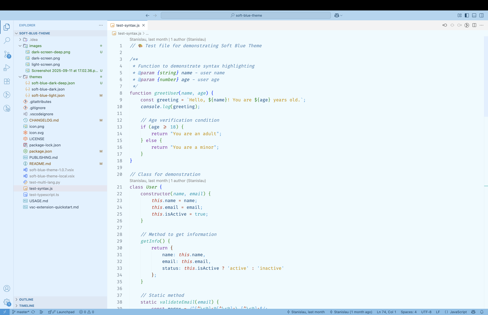
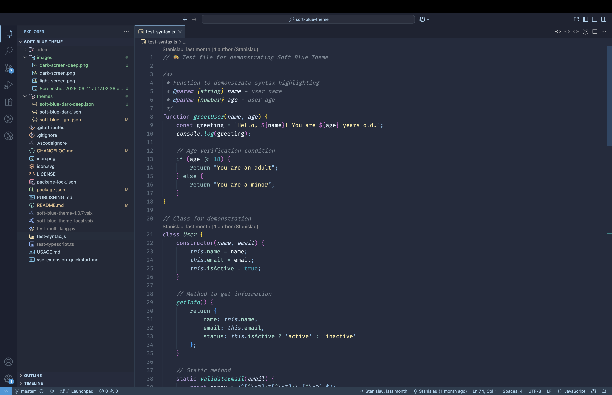
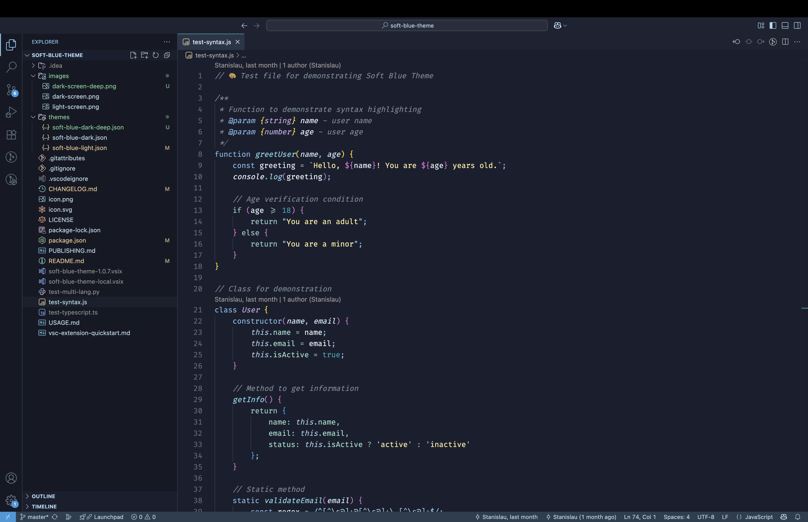

# Soft Blue Theme


A beautiful and calm theme collection for Visual Studio Code with gentle teal and blue colors, designed for comfortable coding. Now featuring **three distinct variants** to suit every preference and environment.

## 🎨 Theme Variants

### 🌞 Soft Blue Light
Perfect for bright environments and daytime coding sessions.
- Clean, professional light interface
- Soft blue-tinted backgrounds to reduce eye strain
- High contrast for excellent readability

### 🌙 Soft Blue Dark  
The classic dark theme with balanced colors and comfortable contrast.
- Original soft blue palette with gentle transitions
- Perfect balance of readability and eye comfort
- Ideal for standard low-light coding

### 🌌 Soft Blue Dark Deep ✨ NEW!
Enhanced deep contrast theme with sophisticated modern accents.
- **Deeper background** (#1A1F2E) for maximum eye comfort
- **Darker sidebar** (#151925) for better visual separation
- **Tiffany blue highlights** for elegant function and cursor styling
- **Premium color palette** with coral, golden, and purple accents
- **Enhanced contrast** for professional development environments

## 📸 Screenshots

### 🌞 Soft Blue Light


### 🌙 Soft Blue Dark


### 🌌 Soft Blue Dark Deep ✨


## ✨ Features

- **🎨 Three beautiful variants** - light, dark, and deep dark themes
- **💎 Tiffany blue accents** - elegant highlights in Deep theme
- **🎯 Enhanced visual separation** - darker sidebar in Deep theme for better organization
- **👁️ Soft transitions** - no harsh colors or high-contrast combinations  
- **📖 Excellent readability** - optimized text contrast for comfortable reading
- **💼 Professional design** - suitable for extended coding sessions
- **🌗 Multiple options** - themes for any time of day or preference
- **🔍 Rich syntax highlighting** - detailed highlighting with sophisticated color choices

## 🎨 Color Palettes

### Deep Theme Highlights:
- **Editor Background**: `#1A1F2E` - deep dark blue
- **Sidebar Background**: `#151925` - darker blue for visual separation
- **Functions**: `#81D4E6` - soft tiffany blue
- **Keywords**: `#7FB8E5` - refined light blue  
- **Cursor/Borders**: `#0ABAB5` - classic tiffany
- **Decorators**: `#FF7F7F` - soft coral
- **Type Annotations**: `#C8A8E8` - elegant purple
- **Enum Values**: `#F4D03F` - golden accent
- **Strings**: `#30D5C8` - bright cyan-green

### Classic Themes:
- **Strings**: `#FFEDA1` - soft yellow
- **Functions**: `#30D5C8` - bright teal
- **Keywords**: `#B19CD9` - gentle purple
- **Comments**: `#7B8794` - muted gray
- **Variables**: `#E1F0FF` - lavender white

## 🚀 Installation

1. Open VS Code
2. Go to Extensions (Ctrl+Shift+X)
3. Search for "Soft Blue Theme"
4. Click Install
5. Select theme: Ctrl+K Ctrl+T → Choose from:
   - **Soft Blue Light** - for bright environments
   - **Soft Blue Dark** - classic dark theme  
   - **Soft Blue Dark Deep** - enhanced deep contrast

## 🔧 Development

For theme development and testing:

```bash
# Install dependencies
npm install

# Run in development mode
F5 (or Run > Start Debugging)
```

## 🤝 Contributing

All suggestions and improvements are welcome! Create issues or pull requests.

## 📝 License

This project is distributed under the MIT License.

## 👨‍💻 Author

**Stanislau Dziarhach** - creator of Soft Blue Theme

---

**Enjoy peaceful coding with Soft Blue Theme!** 💙💎
